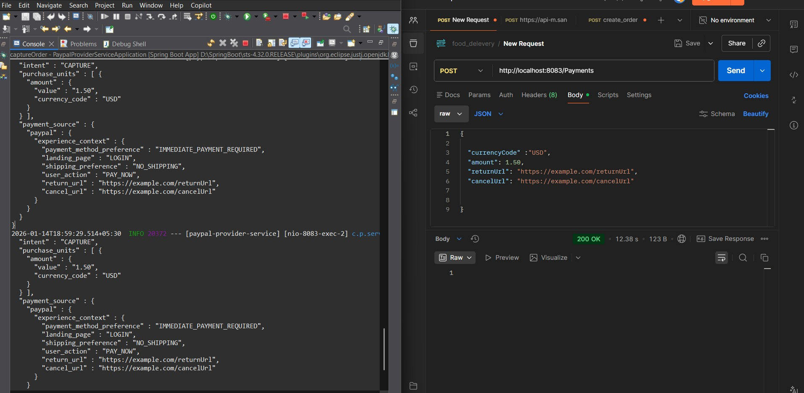
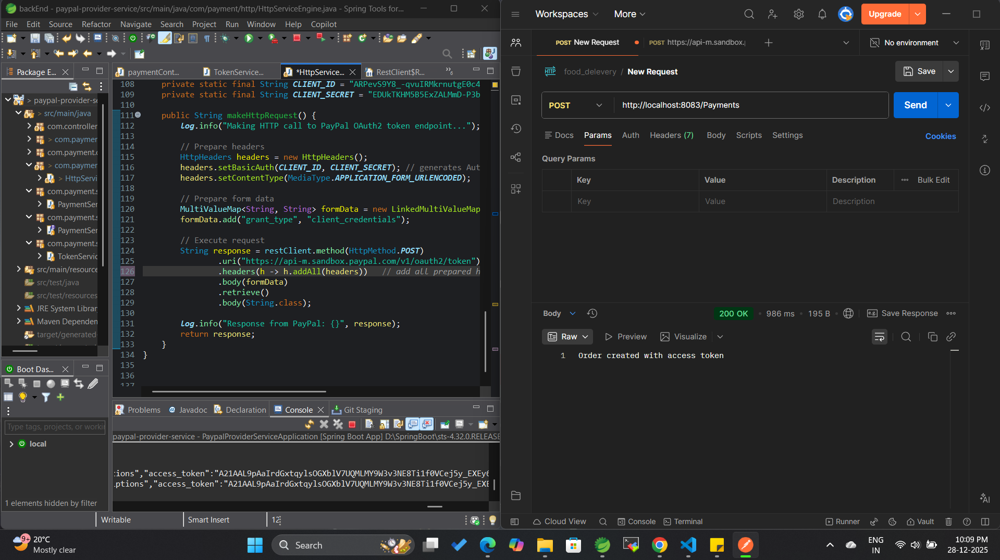

# PayPal Provider Service API

> Spring Boot microservice handling PayPal payment initiation — part of a two-service payment microservices architecture built during internship at HulkHire Tech, Hyderabad.

Deployed on **AWS EC2 via Docker** — Redis caching improved API response time by **40%**, system handled **1,000+ daily requests** in production.

---

## System Architecture

```
Order System
     │
     ▼
paypal_provider_api   ──────────────────────►  PayPal REST API
(Port: 8083)          OAuth2 + JWT Auth         (Sandbox / Live)
     │
     ▼
paypal_processing_service
(Port: 8084)
     │
     ▼
MySQL Database + Redis Cache
```

**Provider Service responsibilities:**
- Accepts payment requests from the order system
- Authenticates with PayPal via OAuth2.0
- Creates PayPal orders and captures payments
- Communicates downstream with `paypal_processing_service`
- Caches responses in Redis for performance

---

## Tech Stack

| Layer | Technology |
|---|---|
| Language | Java 17 |
| Framework | Spring Boot |
| Security | OAuth2.0 + JWT |
| Caching | Redis (40% response time improvement) |
| Containerisation | Docker |
| Cloud | AWS EC2 |
| API Style | REST — JSON request/response |
| Service Discovery | Eureka Service Registry |
| Fault Tolerance | Circuit Breaker (Resilience4j) |
| Routing | API Gateway |
| Build Tool | Maven |

---

## Project Structure

```
paypal_provider_api/
├── src/main/java/com/example/paypal/
│   ├── controller/         # REST endpoints — payment initiation
│   ├── service/            # Business logic + PayPal API calls
│   ├── config/             # OAuth2 + Redis + PayPal configuration
│   └── model/              # Request/Response DTOs
├── src/main/resources/
│   └── application.properties
├── Dockerfile
├── pom.xml
└── README.md
```

---

## Getting Started

### Prerequisites
- Java 17+
- Maven
- Redis (running locally or Docker)
- PayPal Developer Account
- Docker (for containerised run)

### 1. Clone the Repository
```bash
git clone https://github.com/CoderRushikesh/paypal_provider_api.git
cd paypal_provider_api
```

### 2. Configure PayPal Credentials
Open `src/main/resources/application.properties` and replace:

```properties
paypal.client.id=YOUR_PAYPAL_CLIENT_ID
paypal.client.secret=YOUR_PAYPAL_CLIENT_SECRET
paypal.mode=sandbox

spring.redis.host=localhost
spring.redis.port=6379

spring.datasource.url=jdbc:mysql://localhost:3306/paypal_db
spring.datasource.username=YOUR_DB_USER
spring.datasource.password=YOUR_DB_PASSWORD
```

### 3. Run Locally
```bash
mvn clean install
mvn spring-boot:run
```
API available at: `http://localhost:8083`

### 4. Run with Docker
```bash
docker build -t paypal-provider-api .
docker run -p 8083:8083 paypal-provider-api
```

---

## API Reference

### Create PayPal Order
```
POST http://localhost:8083/payments
Content-Type: application/json
```

**Request Body:**
```json
{
  "intent": "CAPTURE",
  "currencyCode": "USD",
  "amount": 100.00,
  "returnUrl": "https://example.com/return",
  "cancelUrl": "https://example.com/cancel"
}
```

**Success Response:**
```json
{
  "status": "success",
  "paymentId": "PAY-123456789",
  "redirectUrl": "https://www.sandbox.paypal.com/checkoutnow?token=EC-123456"
}
```

### Capture Payment
```
POST http://localhost:8083/payments/capture/{orderId}
```

**Success Response:**
```json
{
  "status": "COMPLETED",
  "transactionId": "TXN-987654321",
  "amount": 100.00,
  "currency": "USD"
}
```

---

## Key Features

- **OAuth2.0 Authentication** — secure token-based PayPal API access
- **JWT Security** — all endpoints protected with JWT token validation
- **Redis Caching** — reduced database load, 40% faster API response time
- **Docker Deployment** — containerised for consistent AWS EC2 deployment
- **Separation of Concerns** — clean layered architecture (Controller → Service → Config)
- **Fault Tolerance** — Circuit Breaker prevents cascade failures if PayPal API is unavailable
- **Service Discovery** — Eureka enables zero-config service-to-service communication

---

## Screenshots

**Successful Order Creation:**



**Payment Capture:**



---

## Related Service

- **Processing Service:** [paypal_processing_service](https://github.com/CoderRushikesh/paypal_processing_service-)
  — handles downstream payment processing after provider initiates the order.

---

## Author

**Rushikesh Kamble** — Java Backend Developer  
[GitHub](https://github.com/CoderRushikesh) | [LinkedIn](https://www.linkedin.com/in/rushikesh-kamble-605a38293/) | [Portfolio](https://myselfrushi.netlify.app/)
